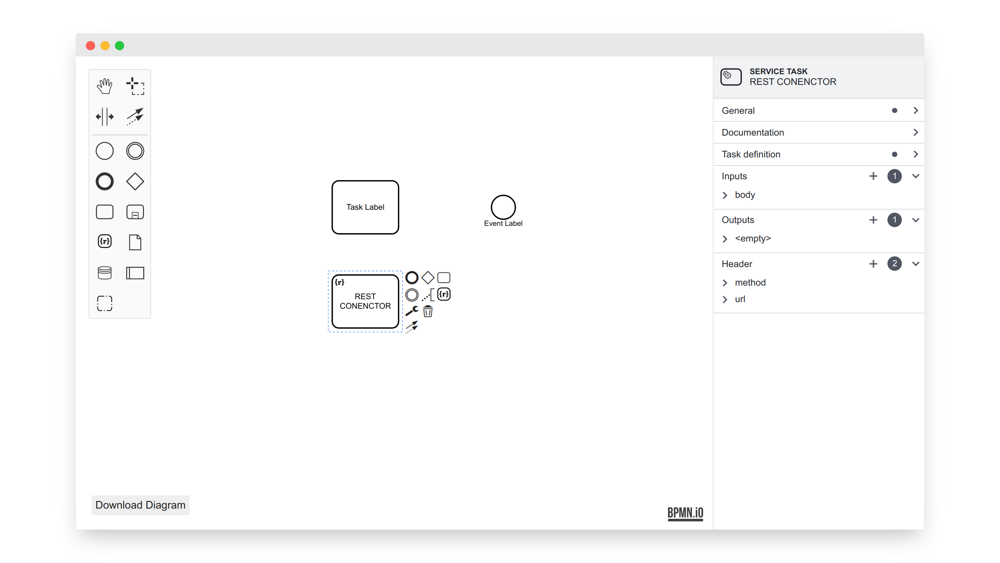

# bpmn-js-connectors-extension

[](https://github.com/bpmn-io/bpmn-js-connectors-extension/actions/workflows/CI.yml)

This module extends [bpmn-js](https://github.com/bpmn-io/bpmn-js) with an element templates everywhere modeling experience. 

[](https://potential-winner-9f6a854d.pages.github.io/)


## Features

Built on top of [element templates](https://docs.camunda.io/docs/components/modeler/camunda-modeler/element-templates/camunda-modeler-element-templates/):

* Append template tasks during modeling
* Upgrade template task via replace menu
* (Optionally) Upgrade template tasks via properties panel
* Modern replace and append with search + keyboard support
* Documentation links and icons
* Visually distinguish template tasks from standard BPMN tasks on the canvas

## Resources

* [Issues](https://github.com/bpmn-io/bpmn-js-connectors-extension/issues)
* [Changelog](./CHANGELOG.md)


## Use Extension

Install via npm:

```
npm install bpmn-js-connectors-extension
```

Use in your [bpmn-js powered editor](https://github.com/bpmn-io/bpmn-js):

```javascript
import ConnectorsExtensionModule from 'bpmn-js-connectors-extension';

import 'bpmn-js-connectors-extension/dist/connectors-extension.css';

const modeler = new BpmnModeler({
  additionalModules: [
    ...,
    ConnectorsExtensionModule,
  ],
  moddleExtensions: {
    zeebe: ZeebeModdle
  }
});
```

The extension relies on `elementTemplates` to be provided via additional setup, i.e. [camunda-bpmn-js](https://github.com/camunda/camunda-bpmn-js).

See [`example`](./example) for a full featured demo or [check it out in action](https://potential-winner-9f6a854d.pages.github.io/).


## Configuration

Customize this extension via the `connectorsExtension` config: 

| Option | Impact |
| :--- | :--- |
| `appendAnything=false` | If `true`, append and create anything modeling experience |
| `elementTemplateChooser=true` | If `false`, do not integrate with the properties panel element template chooser |


## Related

* [@bpmn-io/element-templates-icons-renderer](https://github.com/bpmn-io/element-templates-icons-renderer) - A renderer for task icons


## Run locally

To run the demo application, execute:

```
npm start
```
