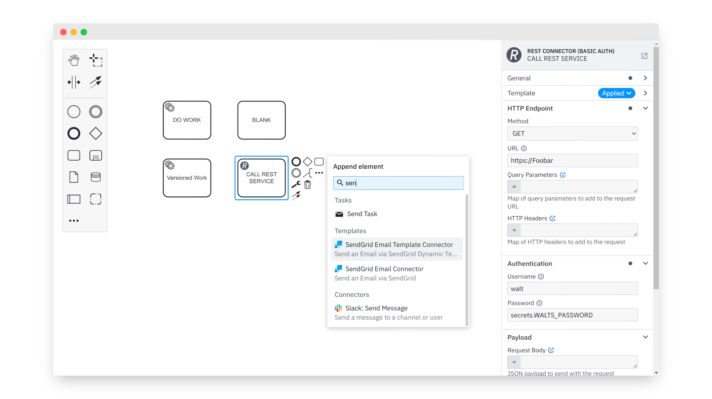

# Connectors Modeling Demo

[](https://github.com/bpmn-io/connectors-modeling-demo/actions/workflows/CI.yml)

This demo showcases the in-the-works connectors modeling experience. Some day maybe to be integrated into the Camunda Modeler ([Web](https://github.com/camunda/web-modeler)/[Desktop](https://github.com/camunda/camunda-modeler)).

[](https://bpmn-io.github.io/connectors-modeling-demo/)


## Features

* Create connector tasks from the palette and context pad
* Visually distinguishable from other tasks


## Use Extension

The [`connectors-extension`](./connectors-extension) is all that is needed to extend [bpmn-js](https://github.com/bpmn-io/bpmn-js) for connectors.


## Run locally

To run the demo application, execute:

```
npm start
```
